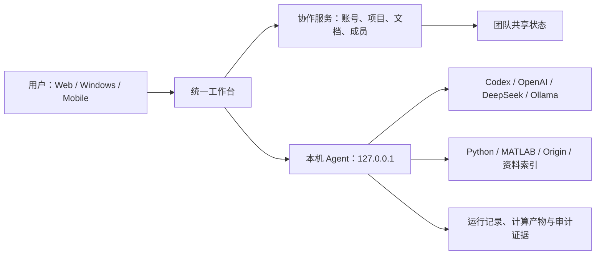
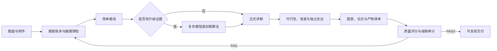

# 数模工作台（Math Modeling Workbench）

> 一个把数学建模 Agent、可复现计算、质量审计与 QilinTeX 协作论文编辑整合到同一项目上下文中的本地优先工作台。

[](https://github.com/sunrise690/math-modeling-expert-agent/actions/workflows/integrated-ci.yml)


数模工作台面向 CUMCM、MCM/ICM、校赛及日常建模研究。它不只生成模型建议，而是尝试完成一条可检查、可复算、可回退的闭环：

> 题意拆解 → 简单基线 → 模型升级 → 实际求解 → 图表与论文 → 独立验证 → 质量审计

项目由两部分组成：根目录的 Python 数模 Agent 负责模型调用、资料检索、计算工具和证据门禁；`qilintex/` 提供唯一用户前端、多人协作、LaTeX 编辑以及 Windows/Web/移动端构建。二者共享同一个项目、成员、文件和 Agent 对话上下文。


<sub>当前纯在线界面（2026-08-13）：统一项目资源管理器、建模流程、QilinTeX 工作区入口与本机 Agent 状态，不展示客户端安装或下载入口。</sub>

## 最新进展

更新时间：**2026-08-13**

| 模块 | 当前状态 | 已落地内容 |
|---|---|---|
| 统一工作台 | 可运行 | “建模 Agent”与“QilinTeX”在同一 React 工作台内切换，共享项目文件、成员与对话上下文 |
| 纯在线界面 | 可运行 | Web 端只保留项目、论文编辑与协作，不展示客户端安装包、下载浮条或桌面推广 |
| 本机 Agent | 可运行 | Windows App 自动启动仅监听 `127.0.0.1` 的 Python 服务；源码安装可一键创建托管 Python 环境 |
| 模型通道 | 可运行 | 支持 Codex Runtime、OpenAI Responses、DeepSeek、OpenAI 兼容接口和 Ollama；页面可保存与测试配置 |
| 数模工作流 | 可运行 | 支持建模、整题交付、论文和质检四种模式；具备阶段状态、证据失效、质量评分和失败回滚机制 |
| 计算与资料 | 可运行 | 已接入数据预检、受限 Python、优化/统计、资料全文索引，以及可选 MATLAB/Origin 后端 |
| 协作论文 | 可运行 | 支持项目文件、多人实时协作、LaTeX 编译、邀请、团队登录与多端会话隔离 |
| 可移植桌面端 | 已实现 | Windows 构建会打包独立 Python/Codex 运行时，生成安装版和便携版；模型凭据保留在用户电脑 |
| 多端发布链 | 已配置 | GitHub Actions 覆盖 Web 校验、Windows 包、Android APK/AAB 与 iOS Simulator 构建；正式签名和商店审核仍待配置 |
| 论文语料规则 | 已接入 | 公开仓库保留脱敏派生规则：70 份 2009—2023 国赛 A 题论文，以及 18 份 2023—2025 华数杯论文的结构化索引 |

当前版本已经完成的关键变化：

- 云端协作服务与本机模型运行彻底分离：服务器不保存、转发或代管 Provider 凭据。
- Codex 支持浏览器登录与设备码回退；公开接口只返回会话状态，不回显认证材料。
- API Key 按 Provider 分开保存；Windows 使用 DPAPI，本机设置不会在团队成员之间同步。
- 工作流状态机能在上游输入或证据改变后使下游门禁失效，避免旧结果继续冒充当前结果。
- 质量评分把问题覆盖、模型严谨性、复现、验证、交付和真实性分开检查，硬失败不会被平均分掩盖。
- QilinTeX 增加完整相对路径项目文件、协作文档兼容、个人资料与独立登录域。

## 当前验证状态

以下结果在 2026-08-13 的当前提交上本地执行通过：

```text
Python 单元/集成测试        162 passed
Web/Server/Desktop 测试      23 passed
TypeScript 类型检查          PASS
生产构建                     PASS
生产前端同源/纯在线检查      PASS
```

复现命令：

```powershell
python -m unittest discover -s tests -p "test_*.py"
pnpm test:web
pnpm typecheck
pnpm build
```

生产构建目前仍有一个非阻塞提示：前端主 JavaScript chunk 压缩前约 `723 KB`，后续将通过按工作区懒加载和手工分包降低首屏体积。

## 五分钟启动

### 环境要求

- Node.js 20 或更高版本
- pnpm 11（建议通过 Corepack 启用）
- Python 3.11 或更高版本
- 至少一种模型通道；MATLAB 与 Origin 均为可选能力

### 安装与运行

```shell
git clone https://github.com/sunrise690/math-modeling-expert-agent.git
cd math-modeling-expert-agent
pnpm setup
pnpm dev
```

打开 <http://localhost:5173/>。根目录命令会同时启动统一前端、协作服务和本机数模 Agent。

首次运行时可将 [`.env.example`](.env.example) 复制为 `.env`。默认配置使用仓库相对目录，不需要复刻开发者的绝对路径：

```text
.agent-data/                 # 本机 Agent 任务、索引、设置与产物
qilintex/apps/server/data/   # 协作服务项目与会话数据
knowledge/                   # 默认本地资料目录
```

常用命令：

```powershell
pnpm dev             # Web 工作台 + 协作服务 + 本机 Agent
pnpm dev:desktop     # 增加 Electron 桌面端
pnpm build           # 生产 Web 与服务端构建
pnpm test:web        # 前端、服务端、桌面端与启动脚本测试
pnpm typecheck       # 全工作区类型检查
```

Windows 安装器和便携版：

```powershell
pnpm --dir qilintex build:win
```

## 系统结构



这个边界是项目的核心安全设计：

- 协作服务器同步项目和文档，但不运行成员的模型任务，也不持有成员的模型密钥。
- Windows App 在每台电脑上启动自己的本机 Agent，使用本机登录、网络、资料和计算软件。
- Web 端可使用协作能力；需要本地模型和本地工具时，应连接可信的本机运行器。

## 建模原则与证据门禁

Agent 默认遵循“简单模型优先，复杂度由证据驱动”：

| 层级 | 默认方法 | 何时升级 |
|---|---|---|
| L0 | 量纲、极限情形、数量级和手算界 | 所有任务先执行 |
| L1 | 守恒/几何关系、解析特例、低维确定性基线 | L0 后的首个可运行模型 |
| L2 | ODE/PDE 数值解、确定性搜索、数学规划 | 解析解不可得或约束需要计算 |
| L3 | 多物理耦合、鲁棒优化、多目标优化、结构化组合算法 | 基线误差、约束冲突或计算瓶颈已有证据 |
| L4 | 元启发式、蒙特卡洛、机器学习 | 问题确有随机性、复杂关系或大规模非凸结构，并保留简单基线 |

完整任务会维护结构化状态和证据。输入、代码或关键结果变化后，依赖它们的旧门禁会被标记为失效；只有重新计算和重新验证后才能恢复完成状态。



审计通过只表示工程证据链完整，不代表模型一定正确或论文一定获奖。题意、假设、数据许可、物理合理性和竞赛规则仍需人工复核。

## 已接入能力

| 类别 | 能力 |
|---|---|
| 数据 | CSV、TSV、XLSX、JSON 的字段、缺失、摘要、相关性和样例预检 |
| Python | 每任务独立工作区；NumPy、Pandas、SciPy、statsmodels、scikit-learn、SymPy、NetworkX、pymoo、SimPy |
| 优化与验证 | 线性/非线性/多目标优化，可行性检查、理论界或基线对照、随机多种子统计、样本外验证 |
| 科研图表 | Matplotlib 图形与参数清单，可选 MATLAB/Origin 可编辑工程；要求源数据、单位、灰度和最终页面检查 |
| 论文 | Markdown/DOCX/TeX 产物，摘要数字追踪、逐问闭环、图表引用、占位符和开发措辞审计 |
| 资料库 | PDF、Office、TeX、BibTeX、Python、MATLAB 等文件的哈希增量索引；搜索结果保留页码或工作表定位 |
| 协作 | 团队登录、项目成员、邀请、Yjs 实时文档、项目相对路径文件、LaTeX 编译与版本更新提示 |

`run_python` 和可选的 MATLAB/Origin 工具是受约束的本机进程，但不是面向恶意代码的强安全沙箱。不要运行不可信代码。

## 论文语料与知识边界

仓库只保存经过脱敏的派生索引和方法规则，不上传原论文包或本机绝对路径。当前已接入：

- 2009—2023 国赛 A 题：70 份 PDF、2,441 页，用于模型谱系、验证习惯、图文关系和常见缺陷的检索路由。
- 2023—2025 华数杯：18 份 PDF、706 页，覆盖 A/B/C 题及多类机理、规划、统计、机器学习和仿真路线。

相关文档：

- [国赛 A 题语料索引](skills/cumcm-expert-agent/references/a-paper-corpus-index.md)
- [华数杯语料索引](skills/cumcm-expert-agent/references/huashu-cup-corpus-index.md)
- [图表与写作模式](skills/cumcm-expert-agent/references/a-paper-visual-writing-patterns.md)
- [华数杯图表与写作模式](skills/cumcm-expert-agent/references/huashu-cup-visual-writing-patterns.md)
- [工作流阶段与证据检查点](skills/cumcm-expert-agent/references/workflow-checkpoints.md)

索引、OCR 和关键词只能帮助定位证据，不能替代回读原页；历史论文的模型名称、措辞和结果不会被当作新题答案。

## 仓库结构

```text
.
├─ agent_backend.py        # Provider 调用、任务队列与运行闭环
├─ agent_tools.py          # 数据、计算、绘图、文档和资料工具
├─ server.py               # 仅监听本机回环地址的 Agent API
├─ knowledge_base.py       # 增量全文索引与隐私过滤
├─ quality_scoring.py      # 六维评分与硬门禁
├─ workflow_guard.py       # 建模过程和证据链审计
├─ mcp_servers/            # Codex / MATLAB / Origin 工具桥
├─ skills/cumcm-expert-agent/
│  ├─ SKILL.md             # 专业数模工作流入口
│  ├─ scripts/             # 状态机和确定性工具
│  └─ references/          # 建模、验证、论文与语料规则
├─ scripts/                # 安装、论文审计、绘图和语料分析
├─ tests/                  # Python 单元与集成测试
└─ qilintex/
   ├─ apps/client/         # 唯一 React 前端与 PWA/Capacitor 壳
   ├─ apps/server/         # 项目、登录、协作与编译服务
   ├─ apps/desktop/        # Electron Windows 客户端
   └─ scripts/             # 可移植运行时、安装与发布脚本
```

具体年份赛题、原始附件、完整求解项目和大体积论文语料不属于主仓库，公开前必须单独核对版权、隐私和竞赛规则。详细边界见 [REPOSITORY_LAYOUT.md](REPOSITORY_LAYOUT.md)。

## Provider 与本地配置

| Provider | `AGENT_PROVIDER` | 认证方式 |
|---|---|---|
| Codex Runtime | `codex-cli` | 当前电脑的官方 Codex 登录，不使用 API Key |
| OpenAI Responses | `openai-responses` | 独立 OpenAI API Key |
| DeepSeek | `deepseek` | 独立 DeepSeek API Key |
| OpenAI 兼容接口 | `openai-compatible` | 自定义 HTTPS 地址、模型和可选 Key |
| Ollama | `ollama` | 本机回环地址，通常不需要 Key |

默认 `AGENT_CONFIG_LOCK=0`，可在界面中修改 Provider。设置为 `1` 后界面只读，仅使用 `.env` 或进程环境。远程基础 URL 必须使用 HTTPS；HTTP 仅允许 `localhost`、`127.0.0.1` 等回环地址。

完整变量和五类配置示例见 [`.env.example`](.env.example)。

## 路线图

### 近期

- 前端按工作区拆包，降低首屏主 chunk 体积。
- 增加 Windows 打包运行时的持续冒烟测试和可复核发布清单。
- 扩展真实赛题基准，分别衡量题意覆盖、模型有效性、外推边界、图表可读性和论文论证链。
- 继续把论文语料处理固化为可增量构建、失败恢复和干净重建的代码工作流。

### 正式公网与商店发布前

- 将 JSON 项目存储迁移到 PostgreSQL，对象和协作文档迁移到 S3 兼容存储，并加入事务、备份和历史版本。
- 增加集中式会话吊销、权限审计、邀请审计、限流、病毒扫描和隐私/内容合规流程。
- 把不可信 TeX 编译迁移到无网络、限 CPU/内存/时长的隔离容器。
- 配置 Windows/macOS 代码签名、Apple Developer、Google Play、国内 Android 渠道及 QQ/微信正式审核材料。

## 安全与使用边界

- 本机 Agent 仅监听回环地址，但没有操作系统级的本地用户隔离；同一电脑上的其他进程仍可能访问它。
- `.agent-data/` 包含任务、上传、索引、设置和产物，不应提交到 Git。
- 远程 Provider 会收到完成任务所需的提示、附件摘要或检索片段；只有本地模型与本地工具路径可以完全留在本机。
- Python 审计钩子、路径白名单和资料过滤属于纵深防护，不能替代容器沙箱或人工代码审查。
- 不要提交 API Key、Token、Cookie、个人信息、本机绝对路径或未经许可的论文原文。

## 文档索引

- [专业 Agent 工作流](skills/cumcm-expert-agent/SKILL.md)
- [QilinTeX 与多端工作台](qilintex/README.md)
- [仓库边界与可移植布局](REPOSITORY_LAYOUT.md)
- [质量评分规则](SCORING.md)
- [MCP 与 MATLAB/Origin 后端](MCP.md)
- [环境变量示例](.env.example)

---

本项目仍处于积极开发阶段。它提供建模流程、计算工具和质量门禁，不构成竞赛奖项保证；最终题意解释、模型假设、数据许可和提交内容必须由参赛者复核。
