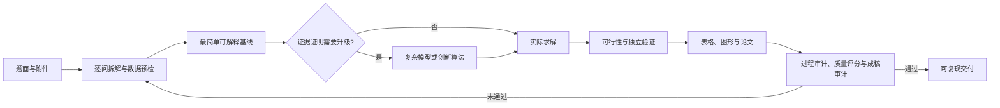

# 数模工作台

> 简单模型优先，复杂度由证据驱动；允许创新算法，但不允许用随机数、机器学习或高级模型名称代替问题结构分析。


数模工作台把数模 Agent 与 QilinTeX 放在同一个前端、同一个项目上下文中。用户可在“建模 Agent”和“QilinTeX”之间直接切换，共享登录、成员、论文、计算产物与 Agent 对话，不需要打开或部署两个站点。

后端包含协作服务和只监听本机回环地址的数模任务服务。它把模型推理、本地资料检索、数据预检、受限 Python 计算、优化与统计、MATLAB/Origin 绘图、论文生成和质量审计接入同一条可复现工作流，面向 CUMCM、MCM/ICM、校赛和日常建模任务。

它的目标不是“给出几个模型名”，而是完成可核验的：

> 题目理解 → 简单基线 → 主模型 → 实际计算 → 图表与结果 → 独立验证 → 论文交付


## 核心特点

| 能力 | 实际约束 |
|---|---|
| 单一项目工作台 | 同一页面切换建模流程和 LaTeX 论文，Agent 在两个工作区中共享当前项目上下文 |
| VS Code 深色交互 | 活动栏、资源管理器、编辑器页签、分栏面板和状态栏保持稳定；`Ctrl+P` 搜索当前可执行命令 |
| 简单模型优先 | 按量纲/手算、解析基线、确定性数值模型、结构化复杂模型、随机/机器学习逐级升级；当前一级已经满足精度时停止加复杂度 |
| 可验证算法创新 | 可以设计解析消元、对称降维、事件驱动、邻域筛选、可行解构造或混合搜索，但必须完成同预算基线、消融、复杂度、稳定性和失效边界检查 |
| 真实计算证据 | 未执行代码不能声称“已求得”；优化结果必须报告求解状态、约束违反量、停止条件和基线/理论界或独立算法对照 |
| 论文级图表 | 每张图先说明要支撑的主张；检查单位、色盲/灰度可辨、图例遮挡、误差表达、最终字号和 PDF 实际页面，不用装饰图代替证据 |
| 完整论文闭环 | 每问形成“模型选择—定义—求解—量化结果—解释—验证”；摘要数字必须能回到正文、表格或计算产物 |
| 结构化过程审计 | 完整解题/成稿必须提交题面、假设、基线、升级依据、主张—证据—验证和修改复验账本；不靠“去 AI 味”掩盖过程缺口 |
| 本地资料检索 | 按内容哈希增量索引 PDF、DOCX、XLSX、TeX、Python、MATLAB 等资料，先检索再回读原页或工作表，不根据文件名猜内容 |
| 本地优先与密钥隔离 | 服务拒绝绑定公网地址；Provider 密钥不通过公开接口回显，图形化配置下使用 Windows DPAPI 保存 |
| 质量评分与回滚 | 从问题覆盖、模型严谨性、复现、验证、交付和真实性六个维度评分；硬门禁失败时不会被平均分掩盖 |

## 五分钟启动

### 环境要求

- Node.js 20 或更高版本与 pnpm 11（推荐通过 Corepack 启用）
- Python 3.11 或更高版本；初始化脚本会在项目内创建托管虚拟环境
- 至少一种可用模型通道：Codex Runtime、OpenAI API、DeepSeek、OpenAI 兼容接口或 Ollama
- MATLAB 与 Origin 均为可选能力，不影响基础 Agent 启动

### 安装与运行

```shell
git clone https://github.com/sunrise690/math-modeling-expert-agent.git
cd math-modeling-expert-agent
pnpm setup
pnpm dev
```

浏览器只需打开 <http://localhost:5173/>。根目录命令会一起启动统一前端、协作服务和数模 Agent；脚本根据自身位置寻找仓库与 Python，不依赖下载者复刻任何开发者目录。

首次运行可把 [`.env.example`](.env.example) 复制为根目录 `.env`。这个文件同时配置统一工作台与数模 Agent；如需仅覆盖协作服务，再创建 `qilintex/.env`。运行数据默认写入仓库相对的 `.agent-data/` 和 `qilintex/apps/server/data/`；如需放到其他位置，使用 `AGENT_DATA_DIR` 与 `DATA_DIR`。

推荐的第一条任务：

```text
先拆解每个子问题，建立最简单的可解释基线；只有基线误差、约束冲突或计算瓶颈被实际证据证明后，才升级模型。需要创新算法时，请给出同预算对照、消融、稳定性和失效边界。
```

## 四种任务模式

| 模式 | 适合输入 | 主要输出 |
|---|---|---|
| 建模 | 赛题、模型疑问、代码需求 | 拆题、数学本质、候选模型、实现路线 |
| 交付 | 完整赛题、数据与模板 | 主路线、计算产物、验证、图表和论文工程 |
| 论文 | 结果、草稿、摘要或现有成稿 | 结构重写、图文论证、语言规范和成稿审计 |
| 质检 | 方案、代码、图表或论文 | 按严重度排序的问题、证据缺口、风险和修复动作 |

任务支持附件、简体中文输出、简要/标准/详细深度，以及公式推导、代码实现、图表方案和风险检查等交付要求。

## 工作流



完整交付会调用 `audit_modeling_workflow`，并生成 manifest、JSON 报告和 Markdown 报告。它针对仿真替代机理、复杂度堆叠、NP-hard 无工程化简、虚构来源、逻辑断链、图表无证据和无反馈迭代等风险；最新最终审计未通过时，质量分最高为 68。审计通过只说明证据链合同完整，仍需人工复核模型和论文。

### 模型升级阶梯

| 层级 | 默认选择 | 进入条件 |
|---|---|---|
| L0 | 量纲、数量级、极限情形、手算上下界 | 所有题目都先执行 |
| L1 | 守恒/几何关系、解析特例、低维回归或确定性基线 | L0 后的首选可运行模型 |
| L2 | ODE/PDE 数值解、事件驱动、确定性搜索与数学规划 | 解析解不可得或约束需要计算 |
| L3 | 多物理耦合、鲁棒/多目标优化、结构化组合算法 | L1/L2 的误差或约束缺口已有证据 |
| L4 | 元启发式、蒙特卡洛、机器学习 | 问题确有随机性、非凸大规模搜索或复杂数据关系，并保留简单基线 |

随机优化至少使用多个有效种子并报告分布；预测模型必须使用结构正确的样本外验证；没有严格证书时，启发式结果只能称为“当前找到的最好可行解”或“候选方案”。

## 优秀论文知识：不只学习解题方法

仓库内的 `cumcm-expert-agent` 已对用户提供的 2009—2023 年国赛 A 题论文包完成结构化提炼：70 份 PDF、2,441 页，覆盖机理、几何、数值计算、拟合估计、优化、调度和验证信号。原 PDF 与本地路径不进入 GitHub，只发布经过隐私化的派生索引和方法规则。

Agent 从论文中学习三层知识：

1. **模型与算法**：题目结构、简单基线、计算内核、验证方式和历史缺陷。
2. **图片与审美**：图形意图、颜色与尺度、三线表、图文邻接、题注、灰度检查和最终页面复核。
3. **写作与行文**：摘要的量化闭环、逐问依赖、假设如何进入公式、结果如何解释、主张强度与证据怎样对应。

历史优秀论文是检索样本，不是标准答案。Agent 会保留其清晰的信息架构，同时修正单次随机搜索、样本内拟合冒充预测、缺少步长收敛、弱题注、默认 Office 图和代码截图等不足。

相关知识文件：

- [模型谱系、简单模型阶梯与算法创新验收](skills/cumcm-expert-agent/references/a-paper-corpus-lessons.md)
- [70 份论文的方法与验证索引](skills/cumcm-expert-agent/references/a-paper-corpus-index.md)
- [图表审美、写作规范与行文模式](skills/cumcm-expert-agent/references/a-paper-visual-writing-patterns.md)
- [章节、摘要、图题和表题呈现索引](skills/cumcm-expert-agent/references/a-paper-presentation-index.md)

OCR 与关键词统计只用于定位原文，不能替代逐页核验；新题的数值结果必须由本次计算重新产生。

## 计算、绘图与论文工具

| 类别 | 主要能力 |
|---|---|
| 数据预检 | CSV、TSV、XLSX、JSON；工作表、字段类型、缺失率、摘要、相关性和样例行 |
| Python | 每任务独立工作区；NumPy、Pandas、SciPy、statsmodels、scikit-learn、SymPy、NetworkX、pymoo、SimPy |
| 优化 | SciPy HiGHS 线性规划，以及通过受限 Python 执行的非线性、多目标、仿真和统计方法 |
| Matplotlib | 折线、散点、分布、热图、多面板、连续事件区间、灵敏度、响应面、Pareto 与多种子分布；输出 PNG/PDF/SVG 和参数 JSON |
| MATLAB | 官方 MCP 状态检查与高层结构化绘图；可保存 PNG/PDF/SVG、FIG 和 M 脚本 |
| Origin | 使用 OriginLab `originpro` 创建图形与可编辑 OPJU，先检查安装、自动化与许可证能力 |
| 报告 | Markdown、DOCX 与论文成稿审计；检查摘要、逐问深度、图表引用、验证和占位符 |
| 资料库 | `search_materials` 定位，`read_material` 回读文件名、页码或工作表；专业 skill 独立按需加载 |

上传文件单个最大 25 MB。`run_python` 与可选 `run_matlab` 都是受约束的本机进程，但不是容器或面向恶意代码的强安全沙箱；不要执行不可信代码。

### MATLAB / Origin 后端（可选）

```powershell
PowerShell -ExecutionPolicy Bypass -File scripts\install_mcp_backends.ps1
```

脚本安装 MCP 侧依赖；MATLAB 本体、Origin 2021+ 与许可证仍需用户自行准备。任意 MATLAB 源码执行默认关闭，只有操作员明确设置 `AGENT_UNSANDBOXED_MATLAB=1` 后才开放，用完应立即恢复为 `0`。

更多说明见 [MCP.md](MCP.md)。

## Provider 与密钥

| Provider | `AGENT_PROVIDER` | 认证方式 |
|---|---|---|
| Codex Runtime 当前登录会话 | `codex-cli` | 使用当前 `CODEX_HOME` 的官方 Runtime/CLI 登录；不使用 API Key |
| OpenAI Responses API | `openai-responses` | 独立 OpenAI API Key |
| DeepSeek | `deepseek` | 独立 DeepSeek API Key |
| OpenAI 兼容接口 | `openai-compatible` | 自定义 HTTPS 地址、模型和可选 Key |
| Ollama | `ollama` | 本机回环地址，通常不需要 Key |

默认 `AGENT_CONFIG_LOCK=0`，页面保存的设置覆盖 `.env` 中的 Provider 运行值。API Provider 的密钥按 Provider 分开保存在 `.agent-data/provider-secrets/`：Windows 使用 DPAPI，Linux/macOS 使用权限为 `0600` 的本机 Fernet 主密钥加密。公开配置接口只返回“是否已配置”。这些机制用于保护磁盘副本，但不等于进程隔离。

设置 `AGENT_CONFIG_LOCK=1` 后，页面进入只读模式，只使用部署环境或 `.env`。完整变量和五种 Provider 示例见 [.env.example](.env.example)。远程基础 URL 必须使用 HTTPS；HTTP 仅允许 `localhost`、`127.0.0.1` 等回环地址。

Codex Runtime 与 OpenAI API 是两条独立通道。项目不会读取、复制或导出 `auth.json`、访问令牌或刷新令牌，也不能仅凭运行状态宣称与 Codex 桌面应用使用同一账号。

## 本地资料库

默认资料目录是仓库内的 `knowledge/`，也可追加一个或多个相对目录：

```env
AGENT_KNOWLEDGE_ROOTS=knowledge
```

支持：`PDF`、`DOCX`、`XLSX`、`CSV`、`TSV`、`JSON`、`Markdown`、`TXT`、`TeX`、`BibTeX`、LaTeX 类/样式文件、Python 与 MATLAB 源码。

启动服务后显式创建或更新索引：

```powershell
Invoke-RestMethod -Method Post http://127.0.0.1:8765/api/knowledge/index
Invoke-RestMethod http://127.0.0.1:8765/api/knowledge/status | ConvertTo-Json -Depth 6
```

索引按内容哈希增量更新并去重。疑似参赛名单、报名表和通讯录默认排除，表格中的姓名、学号、电话、邮箱等敏感列也会过滤；这是启发式保护，不是完整脱敏。通用资料库不会自动 OCR 扫描 PDF，无法提取文本时不会把文件名猜成证据。

## 产物与可复现性

运行数据位于 `.agent-data/`，主要包括：

```text
.agent-data/
├─ runs.db                 # 任务、状态与质量记录
├─ provider-settings.json  # 非密钥 Provider 设置
├─ provider-secrets/       # 跨平台加密的 Provider 密钥
├─ knowledge.db            # 本地资料索引
├─ python-workspaces/      # Python 任务输入、输出和日志
├─ matlab-workspaces/      # 获准 MATLAB 任务产物
└─ codex-workspaces/       # Codex Runtime 独立工作区
```

优化和论文任务应同时保留输入说明、源码、结果表、正式图、关键中间数据、验证报告、结论限制和运行环境。图表、正文与摘要必须使用同一指标定义和数字口径。

## 仓库结构

```text
.
├─ agent_backend.py        # Provider 调用、任务队列与运行闭环
├─ agent_tools.py          # 数据、计算、绘图、文档和资料工具
├─ server.py               # 本机数模任务 API
├─ knowledge_base.py       # 增量全文索引与隐私过滤
├─ quality_scoring.py      # 六维评分和硬门禁
├─ workflow_guard.py       # 结构化建模过程与证据链审计
├─ mcp_servers/            # Codex/MATLAB/Origin 工具桥
├─ skills/cumcm-expert-agent/
│  ├─ SKILL.md             # 专业数模总工作流
│  └─ references/          # 建模、验证、论文与历史语料规则
├─ scripts/                # 安装、论文审计、绘图和语料分析脚本
├─ tests/                  # 单元与集成测试
└─ qilintex/               # 统一前端、协作服务与跨平台启动脚本
```

[`qilintex/`](qilintex/) 是整个项目的唯一用户前端；根目录 Python 服务作为它的内部数模任务后端。两者可以在开发和部署时分进程运行，但不构成两个面向用户的产品。完整启动、部署、协作与发布方式见 [`qilintex/README.md`](qilintex/README.md)。具体年份赛题、原始附件、完整求解项目和大体积论文语料应放在仓库外或独立仓库，公开前单独检查竞赛规则、版权和个人信息。

## API 概览

| 接口 | 用途 |
|---|---|
| `GET /api/health` | Provider、工具、MCP、资料库和队列健康状态 |
| `GET /api/config`、`POST /api/config` | 查看公开配置或保存图形化设置，不返回密钥 |
| `POST /api/config/test` | 不保存配置的连接测试 |
| `GET /api/tools`、`GET /api/mcp` | 当前工具和 MATLAB/Origin MCP 状态 |
| `GET /api/runtime` | worker、活动任务、队列和剩余容量 |
| `POST /api/knowledge/index` | 启动增量资料索引 |
| `GET /api/knowledge/search?q=...` | 检索本地资料 |
| `POST /api/uploads` | 上传单个附件 |
| `POST /api/runs` | 创建任务 |
| `GET /api/runs/{id}` | 读取任务状态和结果 |
| `GET /api/runs/{id}/events` | SSE 运行事件流 |
| `GET /api/runs/{id}/artifacts` | 任务产物列表 |
| `POST /api/runs/{id}/cancel` | 取消排队中或运行中的任务 |

默认最多同时执行 2 个任务并等待 20 个任务，可用 `AGENT_MAX_CONCURRENT_RUNS` 与 `AGENT_MAX_QUEUED_RUNS` 调整；修改后需重启服务。

## 测试

```powershell
python -m unittest discover -s tests -p "test_*.py"
python -m compileall -q agent_backend.py agent_tools.py provider_config.py server.py mcp_servers
```

启动服务后的基本检查：

```powershell
Invoke-RestMethod http://127.0.0.1:8765/api/health | ConvertTo-Json -Depth 8
Invoke-RestMethod http://127.0.0.1:8765/api/config | ConvertTo-Json -Depth 8
Invoke-RestMethod http://127.0.0.1:8765/api/mcp | ConvertTo-Json -Depth 8
```

质量评分字段、硬门禁和封顶规则见 [SCORING.md](SCORING.md)。论文成稿还需要对实际 PDF/DOCX/TeX/Markdown 运行 `audit_competition_paper`，通过审计不代表保证获奖。

## 单独安装为 Codex skill（可选）

如果只想在 Codex 中使用专业工作流，而不启动本地 Web 服务：

```powershell
$target = Join-Path $env:USERPROFILE ".codex\skills\cumcm-expert-agent"
New-Item -ItemType Directory -Force -Path $target | Out-Null
Copy-Item -Path "skills\cumcm-expert-agent\*" -Destination $target -Recurse -Force
```

之后可使用：

```text
使用 $cumcm-expert-agent 完成该数学建模任务：优先建立最简单的可解释模型，仅在证据支持时升级或创新算法，并交付可复现计算、严格验证和专业图文论文。
```

## 安全边界

- 服务仅监听回环地址，但没有本地用户认证；同一台电脑上的其他进程仍可能调用接口。
- 远程 Provider 与 Codex 服务会收到任务内容、必要附件摘要或资料片段；只有 Ollama 与纯本地工具路径可以完全留在本机。
- `.agent-data/` 默认不加密，包含任务、上传、索引和产物；不要把它提交到 Git。
- Python 审计钩子、资料过滤和目录白名单属于纵深防护，不能替代操作系统沙箱、恶意代码隔离或人工审查。
- MATLAB、Origin、Codex CLI 与 MCP Server 都是本机软件或子进程；只安装可信版本，并检查生成脚本和产物。
- 不上传 API Key、认证材料、个人信息、本地绝对路径或未经许可的论文原文。

## 文档索引

- [专业 Agent 工作流](skills/cumcm-expert-agent/SKILL.md)
- [质量评分与硬门禁](SCORING.md)
- [MCP 与可选后端](MCP.md)
- [QilinTeX 协作工作台](qilintex/README.md)

---

数模 Agent 提供工作流、工具与质量门禁，不构成竞赛奖项保证。最终题意解释、模型假设、数据许可、论文规范和提交内容仍需参赛者人工复核。
