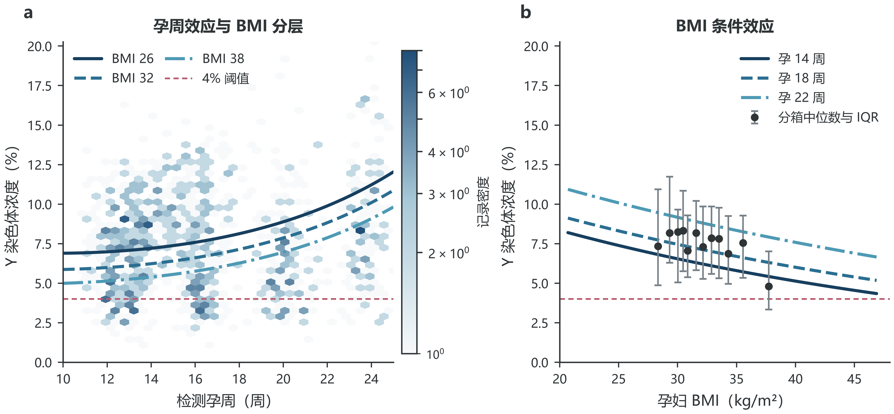
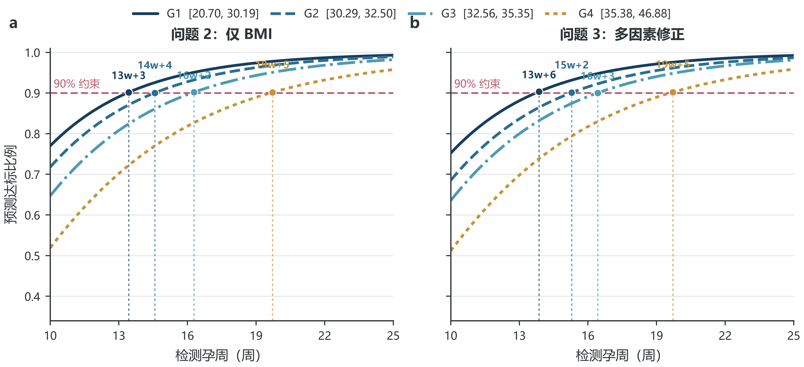
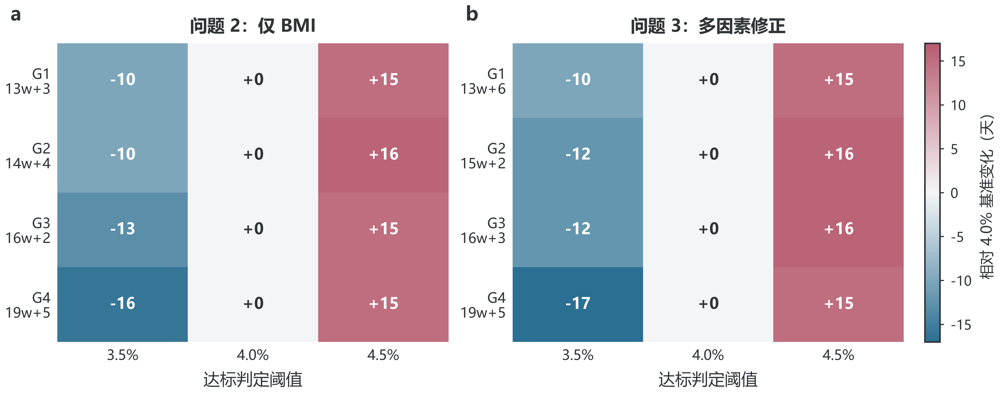
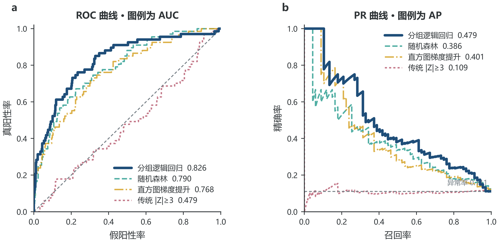
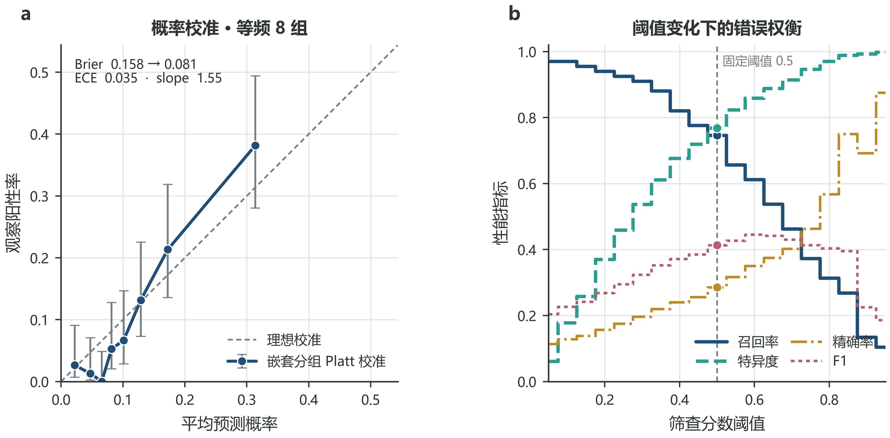
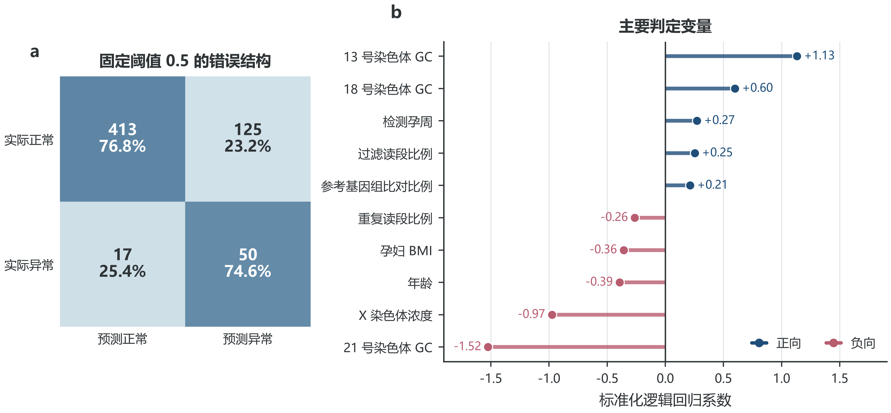
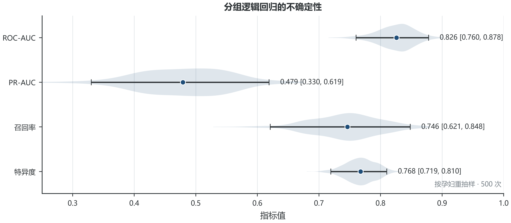

# NIPT 的时点选择与胎儿异常判定

## 摘要

本文基于 2025 年全国大学生数学建模竞赛 C 题附件，对 267 名男胎孕妇的 1082 条重复检测记录和 147 名女胎孕妇的 605 条记录进行建模。针对同一孕妇多次检测造成的组内相关，问题 1 采用随机截距混合效应模型；问题 2、3 将 4% 浓度首次达标视为区间删失事件，建立对数正态加速失效时间模型，并以“预测达标比例不低于 90% 时的最早孕周”为最佳时点；问题 4 使用按孕妇分组的五折交叉验证比较逻辑回归、随机森林、梯度提升和传统 Z 阈值规则。结果表明，孕周对男胎 Y 浓度有显著正效应（对数尺度系数 0.0382, p=3.23e-48），BMI 有显著负效应（-0.0224, p=0.00258），个体内相关系数达到 0.732。仅 BMI 模型得到四组推荐时点，多因素模型用于问题 3 的风险修正。女胎分组逻辑回归的 ROC-AUC 为 0.826，明显优于传统 |Z|≥3 规则。结论适用于本附件覆盖的人群与赛题假设，不构成临床建议。

**关键词：** NIPT；混合效应模型；区间删失；AFT；BMI 分组；分组交叉验证

## 1 问题重述与数据

NIPT 在孕 10 至 25 周利用母体血液中的胎儿游离 DNA 进行染色体异常筛查。男胎 Y 染色体浓度达到 4% 是结果基本可靠的重要条件；女胎则需结合常染色体、X 染色体和测序质量指标判定异常。附件存在多次采血和重复检测，故所有验证均以孕妇代码为分组单位。

| 工作表 | 记录数 | 孕妇数 | 平均重复次数 | 孕周缺失 | BMI缺失 | 标签阳性数 | 标签阳性率 |
| --- | --- | --- | --- | --- | --- | --- | --- |
| 男胎 | 1082 | 267 | 4.052 | 1 | 0 | 937 | 0.866 |
| 女胎 | 605 | 147 | 4.116 | 0 | 1 | 67 | 0.1107 |

## 2 模型假设

1. 附件中的孕妇代码唯一标识同一孕妇，重复行之间存在组内相关。
2. 观测到首次达标前最后一次未达标与首次达标时点之间包含真实达标时点；首次观测即达标视为左删失，从未达标视为右删失。
3. 赛题所称检测误差用 3.5%、4.0%、4.5% 三个达标阈值进行敏感性分析。
4. 最佳时点定义为某 BMI 组预测达标比例首次达到 90% 的孕周；这等价于在满足可靠性约束后尽可能保留治疗窗口。
5. 女胎异常标签以附件“染色体的非整倍体”是否为空为准，不以出生健康字段替代。

## 3 问题 1：Y 浓度关系模型

设第 $i$ 名孕妇第 $j$ 次检测的 Y 浓度为 $Y_{ij}$，孕周为 $W_{ij}$，BMI 为 $B_{ij}$。建立

$$
\log Y_{ij}=\beta_0+\beta_1W_c+\beta_2W_c^2+\beta_3B_c+\beta_4W_cB_c+\beta_5A_c+\beta_6GC_c+\beta_7F_c+u_i+\epsilon_{ij},
$$

其中 $u_i$ 为孕妇随机截距。模型成功收敛，边际 $R^2=0.144$，条件 $R^2=0.770$，ICC=0.732$。高 ICC 说明不同孕妇之间的稳定差异远大于单次测量噪声，普通 OLS 会低估不确定性。按孕妇分组的五折验证 MAE 为 0.0270。

## 4 问题 2：BMI 分组与时点

对每名孕妇构造首次达标时间区间 $(L_i,U_i]$，令

$$
\log T_i=\alpha_0+\alpha_1 BMI_i+\sigma\varepsilon_i,\qquad \varepsilon_i\sim N(0,1).
$$

四组连续 BMI 区间通过动态规划最小化个体 90% 达标分位数的组内平方差，并保证每组至少 35 人。推荐结果如下：

| 组别 | BMI区间 | 孕妇数 | 推荐时点 | 预测达标比例 |
| --- | --- | --- | --- | --- |
| 1 | [20.70, 30.19] | 70 | 13w+3 | 0.9016 |
| 2 | [30.29, 32.50] | 89 | 14w+4 | 0.9003 |
| 3 | [32.56, 35.35] | 73 | 16w+2 | 0.902 |
| 4 | [35.38, 46.88] | 35 | 19w+5 | 0.9016 |

## 5 问题 3：多因素修正

在 BMI 基础上加入年龄、身高、受孕方式、怀孕次数和生产次数，仍采用区间删失 AFT 模型。为避免决策时点泄漏，不使用检测后才得到的 Z 值、读段比例或 Y 浓度作为时点预测变量。结果为：

| 组别 | BMI区间 | 孕妇数 | 推荐时点 | 预测达标比例 |
| --- | --- | --- | --- | --- |
| 1 | [20.70, 31.40] | 126 | 13w+6 | 0.9033 |
| 2 | [31.41, 32.95] | 50 | 15w+2 | 0.9008 |
| 3 | [33.01, 35.35] | 56 | 16w+3 | 0.9003 |
| 4 | [35.38, 46.88] | 35 | 19w+5 | 0.902 |

多因素模型 AIC 为 364.38，仅 BMI 模型 AIC 为 358.57。多因素模型的 AIC 并未降低，因此它主要用于刻画异质性和风险修正，不应被表述为显著优于 BMI 主模型。将达标阈值在 3.5% 至 4.5% 之间调整时，推荐时点最大变化 17.0 天，说明检测误差会对高 BMI 组产生更明显的时点推迟。

## 6 问题 4：女胎异常判定

以 Z13、Z18、Z21、ZX、X 浓度、GC 指标、读段数及比例、BMI、年龄和孕周为输入，比较四种方法。五折划分始终保持同一孕妇只出现在一个折中。

| 模型 | roc_auc | pr_auc | precision | recall | specificity | f1 |
| --- | --- | --- | --- | --- | --- | --- |
| 分组逻辑回归 | 0.826 | 0.479 | 0.286 | 0.746 | 0.768 | 0.413 |
| 随机森林 | 0.790 | 0.386 | 0.442 | 0.343 | 0.946 | 0.387 |
| 直方图梯度提升 | 0.768 | 0.401 | 0.397 | 0.373 | 0.929 | 0.385 |
| 传统 |Z|≥3 | 0.479 | 0.109 | 0.089 | 0.060 | 0.924 | 0.071 |

选择分组逻辑回归作为主模型，因为其排序能力最好且系数可解释。阈值 0.5 下召回率为 0.746、特异度为 0.768。按孕妇整组重抽样 500 次后，ROC-AUC 的 95% 置信区间为 [0.760, 0.878]。传统 |Z|≥3 在本附件上表现较弱，说明 AB 标签不能由单次三条常染色体 Z 值的绝对值阈值完全复现；联合质量和个体指标更合适。

类别加权输出用于筛查排序，不直接当作真实风险概率。经嵌套分组 Platt 校准后，Brier 分数由 0.158 降至 0.081；阈值权衡图同时展示召回率、特异度、精确率与 F1 随筛查分数阈值的变化。

## 7 稳健性与局限

1. 所有交叉验证按孕妇分组，消除了重复测量泄漏，但样本来自高 BMI 人群，外推到一般孕妇需重新校准。
2. 218 名男胎孕妇首次观测即已达标，属于左删失，说明真实首次达标时间早于观测；AFT 模型比直接把首次观测周当作达标周更合理，但仍依赖分布假设。
3. 4% 阈值误差敏感性已显式检查；更完整的临床误差模型需要实验室重复测量方差。
4. 女胎异常样本仅 67 条，PR-AUC 比准确率更有解释价值；模型输出只能作为赛题中的风险判定，不是医学诊断。

## 8 结论

混合效应结果支持“孕周增加、Y 浓度上升；BMI 增加、Y 浓度下降”，同时指出孕妇个体差异是主要变异来源。问题 2 和问题 3 的四组时点分别由表中给出，高 BMI 组需要明显更晚的检测时点。女胎判定中，联合多指标的分组逻辑回归优于单一 Z 阈值。完整代码、处理后数据、表格和图形均可由 `python src/run_all.py` 重新生成。

## 参考文献

[1] 全国大学生数学建模竞赛组委会. 2025 年高教社杯全国大学生数学建模竞赛赛题, 2025.

[2] Deng C, et al. Maternal and fetal factors influencing fetal fraction: a retrospective analysis of 153,306 pregnant women undergoing noninvasive prenatal screening. 2023. PMID: 37114008.

[3] Gazdarica J, et al. Insights into non-informative results from non-invasive prenatal screening through gestational age, maternal BMI, and age analyses. 2024. PMID: 38452118.

[4] Rolnik DL, et al. Influence of Body Mass Index on Fetal Fraction Increase With Gestation and Cell-Free DNA Test Failure. 2018. PMID: 29995742.

[5] Zhang X, et al. Evaluation of the Z-score accuracy of noninvasive prenatal testing for fetal trisomies 13, 18 and 21 at a single center. 2021. PMID: 33480032.
